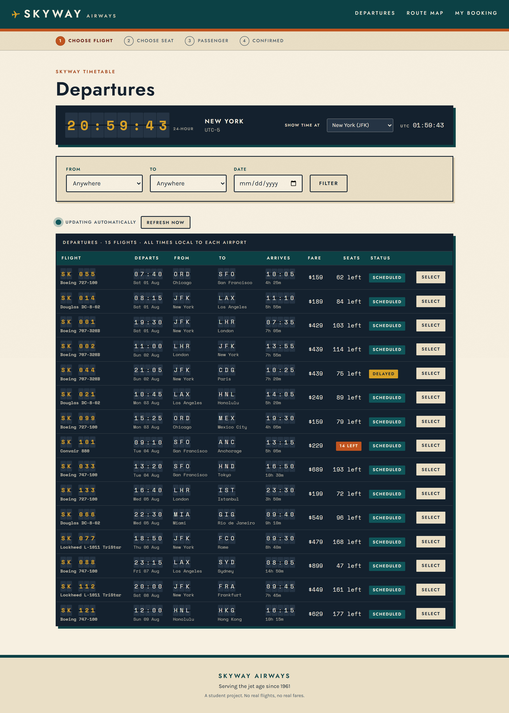
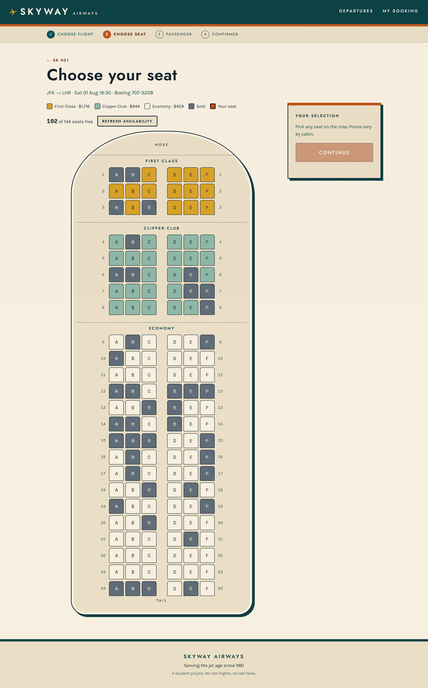
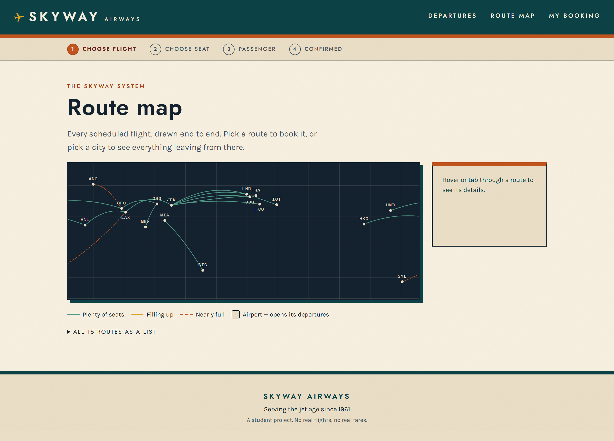

# Skyway Airways ✈

A flight booking web app with an **interactive seat map**, styled as a
1960s–70s jet-age airline. Browse a split-flap departure board, pick a seat from
a live cabin plan, enter passenger details, and get a retro boarding pass with a
booking reference that persists to SQLite.

**Live demo:** _(paste the Render URL here after deploying — see [Deploying](#deploying))_

> **Before a live demo:** open the URL a few minutes early. Render's free tier
> sleeps after 15 minutes idle and takes ~50 seconds to wake.



---

## The standout feature: the interactive seat map



Every flight has a real cabin drawn from the database, not a hardcoded grid.

- **Geometry comes from the `aircraft` table.** A Boeing 707 renders A–F with a
  single aisle after C; a Lockheed L-1011 renders A–H with aisles after B and F;
  a 747 renders 28 rows of A–H,J. Adding an aircraft changes the map with no
  template edits.
- **Class-based pricing, live.** Selecting a seat updates a panel showing
  `base fare × cabin multiplier = total` with no page reload
  (First ×4.0, Business ×2.2, Economy ×1.0).
- **Live availability.** The map refetches `/api/flights/<id>/seats` on tab
  focus, every 30 seconds while visible, and on demand. If the seat you picked
  is sold while you are choosing, it flashes, clears your selection and says so.
- **Sold seats carry a hatch pattern and a strikethrough**, not just a colour,
  so state is legible without colour vision.
- **Keyboard and screen-reader usable.** Arrow keys move around the grid,
  Enter/Space selects, sold seats stay focusable via `aria-disabled`, and a
  `role="status"` region announces every change.
- **Works with JavaScript disabled** — each seat is a plain submit button; the
  script enhances that markup rather than replacing it.

### How double-booking is prevented

Three layers, and only the last one is authoritative:

1. The browser is a *view* — it can be stale or tampered with; nothing trusts it.
2. The server re-checks availability before writing, for a friendly message.
3. **The database decides.** A partial unique index —
   `CREATE UNIQUE INDEX one_active_booking_per_seat ON bookings (seat_id) WHERE status = 'CONFIRMED'`
   — means the second sale of a seat cannot commit. Writes run inside
   `BEGIN IMMEDIATE`, so the seat is locked in the same transaction that creates
   the booking.

Verified with 12 threads confirming the same seat simultaneously: **1 booked,
11 refused, 0 lock errors, 0 orphan rows.**

---

## Running it locally

Requires Python 3.11+ (developed on 3.14, deployed on 3.13).

```bash
python -m venv .venv
.venv\Scripts\python -m pip install -r requirements.txt   # Windows
.venv\Scripts\python run.py
```

```bash
python3 -m venv .venv                                     # macOS / Linux
.venv/bin/python -m pip install -r requirements.txt
.venv/bin/python run.py
```

Then open <http://127.0.0.1:5000>. The database is created and seeded on first
run — there is no separate migrate or seed step.

**Other commands**

```bash
python seed.py                        # rebuild/print the timetable as a departure board
python -m unittest discover tests     # 28 smoke tests
```

Delete `flights.db` to start over from a clean timetable.

---

## The departure hall



Three things keep the board feeling live rather than printed:

- **Split-flap clock.** The same flip tiles as the board, showing 24-hour time
  at any airport Skyway serves, with **UTC always beside it** as a fixed
  reference. Your choice is remembered between visits. Offsets are whole hours
  and ignore daylight saving, matching how the timetable stores its times.
- **Self-refreshing board.** Seats, fares and status refetch every 60 seconds,
  on demand via **Refresh now**, and whenever you return to the tab. Only the
  cells whose values actually changed are touched — and they glow briefly, so a
  seat someone else just booked is visible without the page moving. A ring
  beside the button drains over the interval, so the board's liveness is
  legible without anything blinking for attention.
- **Route map.** Every flight drawn as an arc between its real coordinates.
  Hover or tab a route for its details and click to book it; hover a city to
  light up everything touching it and click to see its departures.

The map is plain SVG, projected server-side in [routemap.py](routemap.py) — no
mapping library, no tiles, nothing to fetch at runtime. Three problems it
solves that are easy to miss:

- **Pacific routes** like LAX–Sydney span 269° of longitude. Drawn naively they
  stripe backwards across the whole map, so they are redrawn the short way and
  mirrored across the seam, leaving one edge and arriving at the other.
- **Return flights** share a great circle exactly, so outbound and inbound are
  offset to either side — otherwise one is buried under the other and can never
  be clicked.
- **Hub departures** to nearby cities (New York to London, Paris, Frankfurt and
  Rome) nearly coincide, so each airport's departures are fanned apart, and
  city codes are placed in the nearest free position around their dot.

## The booking flow

```
/                        search
└─ /flights              split-flap departure board, filter by origin/destination/date
   └─ /flights/<id>      flight detail, cabin prices, "Choose your seat"
      └─ .../seats       interactive seat map
         └─ .../passenger  passenger details, validated server-side
            └─ POST /bookings   passenger + booking written in one transaction
               └─ /bookings/<REF>  boarding pass
```

`/lookup` retrieves any booking by its six-character reference — the quickest
way to prove persistence during a demo. Every boarding pass can be cancelled,
which releases the seat back to the map while keeping the booking in history.

### Routes

| Method | URL | Purpose |
|---|---|---|
| GET | `/` | Landing page and search |
| GET | `/flights` | Departure board; `?origin=&dest=&date=` |
| GET | `/api/flights` | JSON seats/fare/status for the board's live refresh |
| GET | `/map` | Interactive route map |
| GET | `/flights/<id>` | Flight detail and cabin pricing |
| GET | `/flights/<id>/seats` | Interactive seat map |
| GET | `/api/flights/<id>/seats` | JSON seat state (live availability) |
| GET | `/flights/<id>/passenger?seat_id=` | Passenger details form |
| POST | `/bookings` | Create the booking, redirect to the pass |
| GET | `/bookings/<reference>` | Boarding pass |
| POST | `/bookings/<reference>/cancel` | Release the seat |
| GET/POST | `/lookup` | Find a booking by reference |
| GET | `/healthz` | Health check for Render |

---

## Tech stack

| Layer | Choice | Why |
|---|---|---|
| Language | Python 3.13 | Pinned in `.python-version` |
| Web | Flask 3.1 + Jinja2 | One small service, server-rendered, no build step |
| Database | SQLite via stdlib `sqlite3` | Four tables and raw SQL is less code than configuring an ORM |
| Front end | Vanilla JS + CSS | No React, no bundler, no npm |
| Fonts | Jost / Karla / Space Mono | Futura-alike for signage, clean body, mono for the board |
| Server | gunicorn | 1 worker, 4 threads |
| Tests | stdlib `unittest` | No extra dependency |

Runtime dependencies are **Flask and gunicorn only**.

### Project layout

```
app.py          Flask factory and every route
db.py           connections, transactions, all read queries
bookings.py     booking creation and cancellation (the only writes)
seed.py         fleet, timetable, airports, idempotent seeding
seatmap.py      shapes seat rows into the grid + JSON payload
routemap.py     projects flights onto the SVG route map
pricing.py      cabin multipliers and fare formatting
schema.sql      tables, indexes, the partial unique index
templates/      Jinja2 templates
static/js/      seatmap, splitflap (shared tiles), clock, departures, routemap
tests/          28 smoke tests
```

### Database

`airports` → `flights` ← `aircraft`, `flights` → `seats` → `bookings` ← `passengers`

Availability is **derived, never stored**: a seat is free when no `CONFIRMED`
booking points at it. There is no `is_booked` flag to drift out of sync. Money
is stored as integer cents. Times are stored as local clock time at each
airport, exactly as a printed timetable shows them, with `duration_minutes`
holding the true elapsed time.

Seeded with **15 flights** (12 required) across 17 airports and 6 aircraft
types, ~2,400 seats, and ~890 pre-sold so the map looks used. Two flights are
deliberately near capacity: **SK 101** (SFO→ANC, 14 of 72 free) and **SK 088**
(LAX→SYD, 47 of 252 free). Departure dates are generated relative to the seed
date, so the timetable never goes stale.

---

## Deploying

The app self-seeds at startup, which is what makes it work on Render's free
tier: the filesystem is ephemeral, so every deploy begins with no database file.
`create_app()` runs the schema, checks whether any flight exists, and seeds only
if the table is empty — idempotent and safe to re-run.

### Render, click by click

1. Push this repo to GitHub.
2. Sign in at <https://dashboard.render.com> → **New +** → **Web Service**.
3. **Connect your GitHub account**, then pick this repository.
4. Fill in:
   - **Name:** `skyway-airways` (this becomes your URL)
   - **Region:** any
   - **Branch:** `main`
   - **Root Directory:** *(leave blank)*
   - **Runtime / Language:** `Python 3`
   - **Build Command:** `pip install -r requirements.txt`
   - **Start Command:**
     `gunicorn --workers 1 --threads 4 --timeout 60 --bind 0.0.0.0:$PORT "app:create_app()"`
   - **Instance Type:** `Free`
5. **Advanced** → **Add Environment Variable**:
   - `SECRET_KEY` = any long random string
   - `PYTHON_VERSION` = `3.13.4`
6. **Advanced** → **Health Check Path**: `/healthz`
7. **Create Web Service** and wait for the first build (2–4 minutes).
8. Open the URL, then paste it into the **Live demo** line at the top of this file.

Alternatively, use **New + → Blueprint** and Render will read every setting from
[`render.yaml`](render.yaml).

---

## Known limitations

Deliberate scope decisions, not oversights:

- **Bookings do not survive a redeploy.** Render's free disk is ephemeral, so the
  database resets on deploy and on restart after idle. Bookings made during a
  session persist for that session. Moving to Render Postgres would fix this;
  the schema barely changes.
- **No CSRF tokens.** There are no accounts, no money and no session state worth
  forging. Flask-WTF would add a dependency and config surface for no real gain
  here.
- **No payment step.** Confirmation is a booking reference.
- **One seat per booking.** Party bookings would need a booking-group table.
- **Free tier cold starts** take ~50 seconds after 15 minutes idle.

---

*A student project. Skyway Airways is invented; no real airline, flights or
fares are represented.*
